# 赛博烟花 - 完整项目文档

## 📋 项目概述

当你按下手中的按钮，STM32单片机一个激灵："老板吩咐了，干活！"赶紧踹醒旁边的ESP-01s："兄弟醒醒，发消息了！"ESP-01s揉揉眼睛，通过WiFi把"fire"指令丢给电脑。电脑一听"fire"，立马在屏幕上炸出一朵烟花，还自带BGM——整个过程像极了**一群牛马接力传递老板指令**，最后烟花在屏幕上喊："我要炸了"

这就是**赛博烟花**，一个有点抽象、有点无聊的过年主题摸鱼神器。

技术上讲，这是个**Socket通信项目**。STM32+ESP-01s组成硬件端，负责按键触发；Python写的服务器端，负责收指令放烟花。我这么说半天也是迷迷瞪瞪，还是上视频好了[【赛博烟花_哔哩哔哩](https://www.bilibili.com/video/BV1TMZDBAE8c/)

---

## 🚀 快速开始

#### 一、硬件准备

##### 1. ESP-01s烧录AT固件

**下载工具：**

- Flash下载工具：[官方下载链接](https://docs.espressif.com/projects/esp-test-tools/zh_CN/latest/esp32s3/production_stage/tools/flash_download_tool.html)

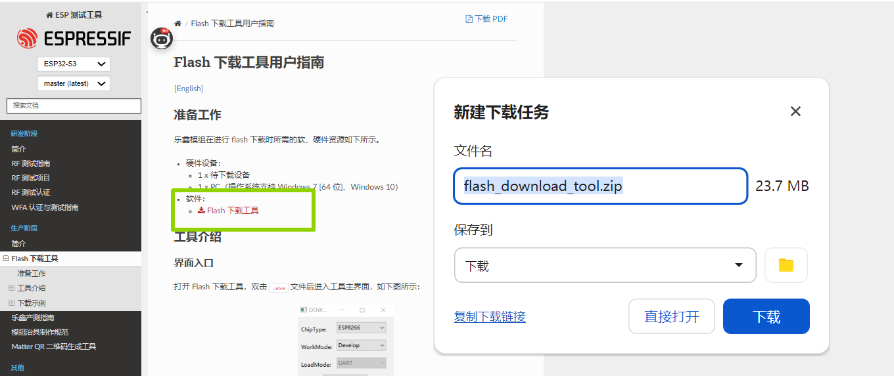

**固件下载：**

- ESP-01s固件：[安信可官方文档](https://docs.ai-thinker.com/esp8266/)


**烧录教程：**

- 参考视频：[B站教程链接](https://www.bilibili.com/video/BV1x14y1S74D/)

> ⚠️ **注意**：AT固件下载时请放在非中文路径

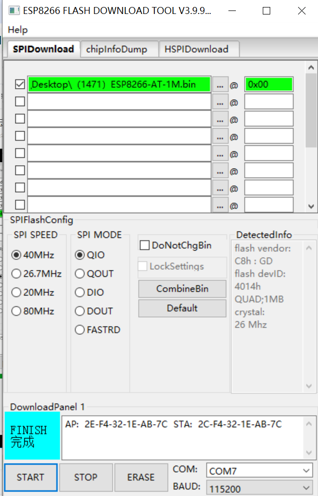

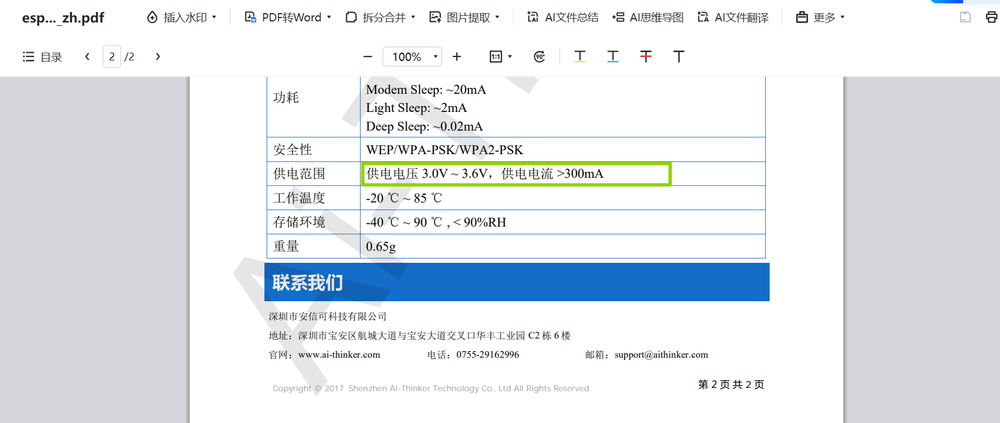

##### 2. ESP-01s AT指令测试

使用USB-TTL连接ESP-01s进行指令测试（串口工具可以去江协科技或者正点原子的资料里面下载）：

```bash
# 1. 测试模块是否正常
AT
# 正常返回：OK

# 2. 设置为Station模式
AT+CWMODE=1
# 正常返回：OK

# 3. 连接WiFi热点（PC和ESP01S需在同一网络）
AT+CWJAP="你的WiFi名称","你的WiFi密码"
# 正常返回：WIFI CONNECTED → WIFI GOT IP → OK

# 4. 建立TCP连接到电脑
AT+CIPSTART="TCP","你的主机IP",8888
# 正常返回：CONNECT → OK

# 5. 准备发送4字节数据
AT+CIPSEND=4
# 正常返回：OK → > 

# 6. 发送数据"fire"
fire
# 正常返回：Recv 4 bytes → SEND OK

# 7. 关闭连接
AT+CIPCLOSE
# 正常返回：CLOSED → OK
```

##### 3. 硬件接线

```
STM32F103C8T6      ESP01S
PA9 (TX)   ------> RX
PA10 (RX)  ------> TX
3.3V       ------> VCC
GND        ------> GND

STM32F103C8T6        OLED
PB6(I2C1_SCL) ------> SCL
PB7(I2C1_SDA) ------> SDA
3.3V          ------> VCC
GND           ------> GND

按键连接：
PB1 ------ 按键 ------ GND  (连接服务器)
PB11 ----- 按键 ------ GND  (发射烟花)
```

#### 二、软件配置

##### 1. PC服务器端配置

确保PC连接到硬件端使用的同一WiFi网络，通过CMD获取本机IP：

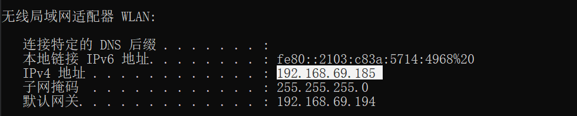

在`SocketServer.py`中配置IP地址：

```python
# ==================== Socket服务器类 ====================
class SimpleSocketServer:
    def __init__(self, host='你的主机IP', port=8888):
    #其他代码……
```

##### 2. 运行服务器程序

```bash
python SocketServer.py
```

正常启动输出：

```
pygame 2.6.1 (SDL 2.28.4, Python 3.11.14)
Hello from the pygame community. https://www.pygame.org/contribute.html
上升音效创建成功
爆炸音效创建成功
服务器启动成功，监听端口: 8888
```

程序自动弹出UI界面，点击进入：


##### 3. 硬件连接测试

按下硬件端连接服务器按钮(PB1)，OLED显示"Connecting"...

连接成功后终端显示：

```
客户端连接: ('192.168.69.151', 64505)
```

OLED显示"ConnectingOK"

> ⚠️ **注意**：目前硬件端尚未做AT返回值判断，ConnectingOK仅表示发送连接请求流程结束，实际连接情况请以PC端输出为准。

##### 4. 发射烟花

按下硬件端放烟花按钮(PB11)，见证奇迹：


---

## 🔧 STM32工程建立说明

### 开发环境

- STM32CubeMX
- Keil5

### 详细配置步骤

#### 基础配置

- **芯片选择**：STM32F103C8T6
- **SYS配置**：
  - 调试接口：Serial Wire（使用ST-Link）
  - Timebase Source：SysTick

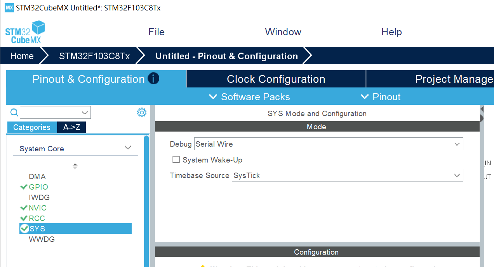

- **时钟配置**：外部晶振，系统时钟72MHz

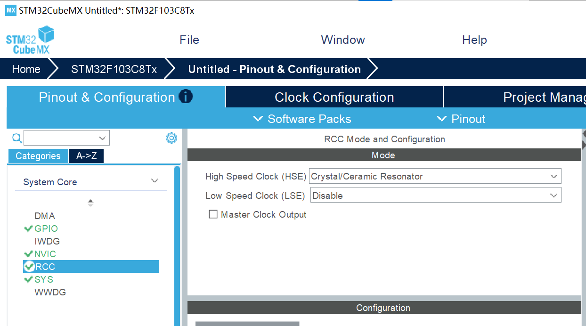

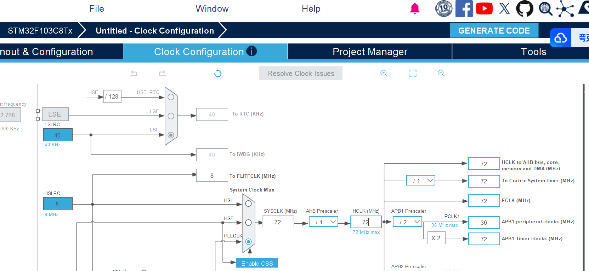

#### GPIO按键配置

```c
/* PB1 按键（连接服务器）*/
- GPIO mode: External Interrupt Mode with Falling edge trigger
- GPIO Pull-up/Pull-down: Pull-up
- User Label: KEY_CONNECT

/* PB11 按键（发射烟花）*/
- GPIO mode: External Interrupt Mode with Falling edge trigger
- GPIO Pull-up/Pull-down: Pull-up
- User Label: KEY_FIRE
```

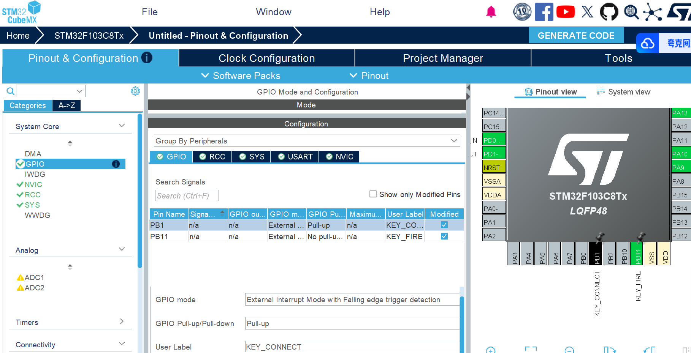

#### USART配置（连接ESP01S）

```c
USART1 配置：
- Mode: Asynchronous
- Baud Rate: 115200
- Word Length: 8 Bits
- Parity: None
- Stop Bits: 1

引脚分配：
- TX：PA9 (USART1_TX)
- RX：PA10 (USART1_RX)
```


#### NVIC中断优先级配置

```c
NVIC配置：
- EXTI line[9:5] interrupts: Enable   (PB1中断)
- EXTI line[15:10] interrupts: Enable (PB11中断)
- USART1 global interrupt: Enable     (串口接收中断)
```

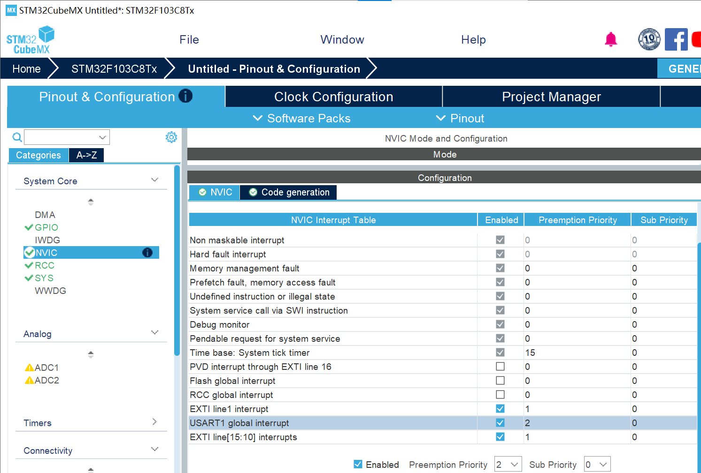

#### I2C配置（OLED显示屏）

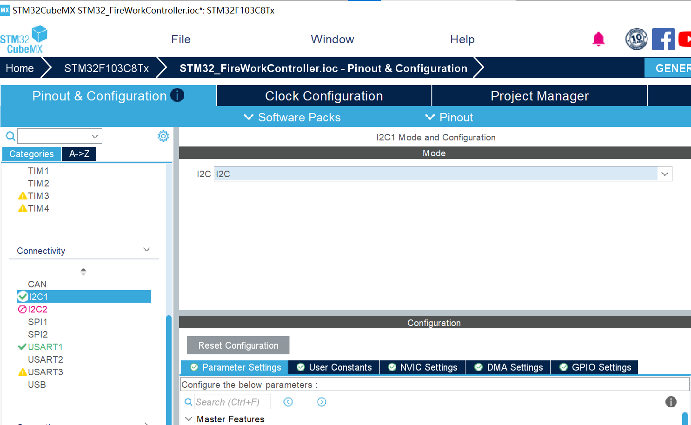

#### 生成工程

#### 在工程文件夹添加OLED驱动

本部分移植了韦东山老师教程中的OLED驱动代码：

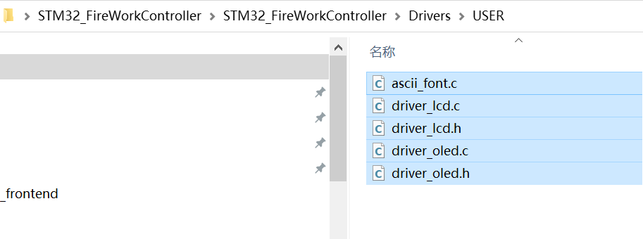

#### 主函数代码编写

```c
/* Includes ------------------------------------------------------------------*/
#include "stdio.h"
#include <string.h>

/* USER CODE BEGIN 0 */
// 全局变量
uint8_t connect_flag = 0;  // 连接标志
uint8_t fire_flag = 0;      // 发射标志
uint8_t esp_connected = 0;  // ESP01S连接状态

// 按键中断回调函数
void HAL_GPIO_EXTI_Callback(uint16_t GPIO_Pin)
{
    HAL_Delay(20); // 消抖
    
    if(GPIO_Pin == KEY_CONNECT_Pin)  // 连接按键
    {
        if(HAL_GPIO_ReadPin(KEY_CONNECT_GPIO_Port, KEY_CONNECT_Pin) == GPIO_PIN_RESET)
        {
            connect_flag = 1;
        }
    }
    else if(GPIO_Pin == KEY_FIRE_Pin)  // 发射按键
    {
        if(HAL_GPIO_ReadPin(KEY_FIRE_GPIO_Port, KEY_FIRE_Pin) == GPIO_PIN_RESET)
        {
            if(esp_connected)
            {
                fire_flag = 1;
            }
        }
    }
}

// ESP01S连接函数
void ESP_Connect(void)
{
    char *at_commands[] = {
        "AT\r\n",
        "AT+CWMODE=1\r\n",
        "AT+CWJAP=\"你的WiFi名称\",\"你的WiFi密码\"\r\n",
        "AT+CIPSTART=\"TCP\",\"你的主机IP\",8888\r\n"
    };
    for(int i = 0; i < 4; i++)
    {
        HAL_UART_Transmit(&huart1, (uint8_t*)at_commands[i], strlen(at_commands[i]), 1000);
        HAL_Delay(2000);
    }
    esp_connected = 1;
}

// 发送烟花指令
void Send_Fire_Command(void)
{
    char send_cmd[] = "AT+CIPSEND=4\r\n";
    char fire_data[] = "fire";
    
    HAL_UART_Transmit(&huart1, (uint8_t*)send_cmd, strlen(send_cmd), 1000);
    HAL_Delay(500);
    HAL_UART_Transmit(&huart1, (uint8_t*)fire_data, strlen(fire_data), 1000);
    HAL_Delay(500);
}
/* USER CODE END 0 */

// 主循环
while (1)
{
    if(connect_flag)
    {
        connect_flag = 0;
        ESP_Connect();
    }
    
    if(fire_flag)
    {
        fire_flag = 0;
        Send_Fire_Command();
    }
}
```

---

## 💻 软件端核心程序详解

#### 核心模块说明

##### SimpleSocketServer类

**初始化配置：**

```python
def __init__(self, host='你的主机IP', port=8888):
    self.host = host          # 服务器IP
    self.port = port          # 监听端口
    self.firework_manager = None  # 烟花管理器引用
```

**服务器启动流程：**

1. 创建TCP Socket
2. 设置地址重用（SO_REUSEADDR）
3. 绑定地址端口
4. 开始监听（最大连接数5）
5. 启动接受线程

**消息处理机制：**

```python
def _process_message(self, message):
    if message.lower() == "fire":
        self.firework_manager.add_firework()
        return f"烟花发射成功"
    return f"收到: {message}"
```

#### 主程序架构

**双线程设计：**

- **主线程**：Pygame图形界面，60fps渲染烟花
- **后台线程**：Socket服务器，处理网络连接

**状态机：**

- 菜单状态：显示开始界面
- 游戏状态：显示烟花效果

**事件处理：**

| 事件     | 触发       | 响应     |
| -------- | ---------- | -------- |
| 窗口关闭 | 点击关闭   | 退出程序 |
| ESC键    | 游戏中     | 返回菜单 |
| ESC键    | 菜单中     | 退出程序 |
| 空格键   | 游戏中     | 发射烟花 |
| 网络指令 | 收到"fire" | 发射烟花 |

---

## 🔍 常见问题排查

### 服务器启动失败

- 检查IP地址是否正确
- 检查端口8888是否被占用
- 确认网络连接正常

### 客户端连接不上

- 确认硬件端WiFi和PC端一致且连接成功
- 检查防火墙设置

### 烟花不显示

- 确认Pygame安装正确
- 检查`cyber_fireworks`模块是否存在

---

## 📝 版本历史

### v1.0 (2024-02-18)

- 初始版本发布
- 实现基础Socket通信
- 支持硬件按键触发烟花
- 支持空格键本地触发

---

##  📄 开源协议 

本项目采用 MIT License 开源协议，随便用，也期待您的建议与交流!

